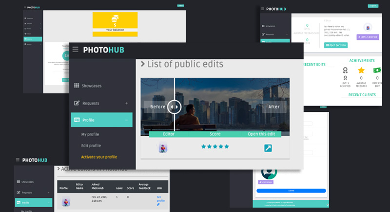

# photoHub
PhotoHub is a platform that connects people to designers, people who knows Photoshop and retouching to work on their photos. The rates for designers eventually increases when they finish the designs before the deadlines and get feedbacks from clients. 

This project is developed with Django. Supporting OTPs with Twilio and paymets through stripe. 

Live demo through [Railway](https://aminrd-photohub.up.railway.app/)

